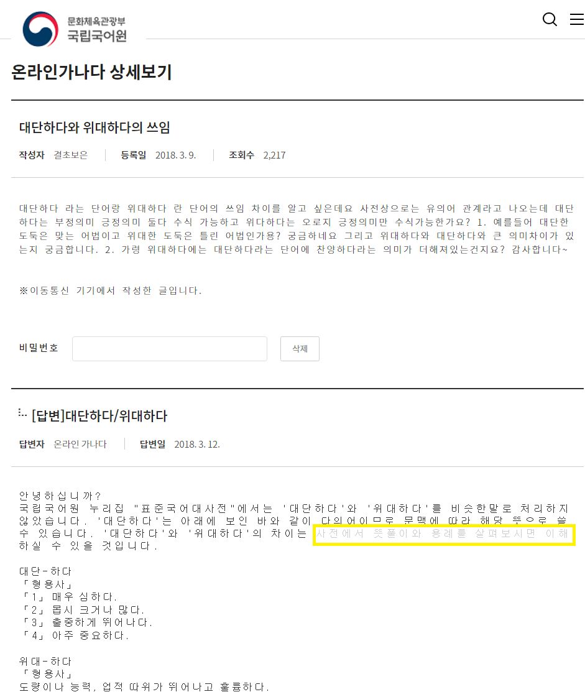
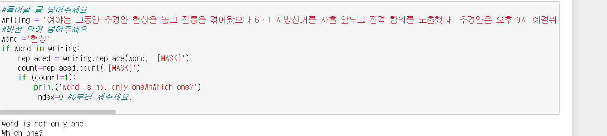
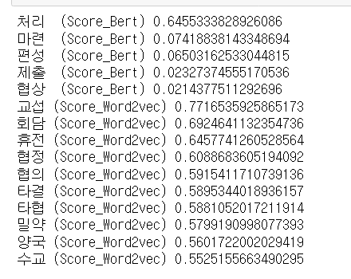

# 한국어 작문 헬퍼

# 배경 및 목표

많은 사람들이 작문과 발화를 할 때 풍부하고 적확한, 있어보이는 표현을 찾기위해 고민을 하고, 인터넷 포털이나 사전에서 유의어와 그 용례를  직접 살펴보는 노력을 하고 있습니다.

이 프로젝트는 작성자의 글과 글에서 바꾸고 싶은 부분을 입력으로 받아 풍부한 다른 표현을 제안합니다.

# 스크린샷 및 이용방법

1. writing에 본인의 글,
2. word에 고치려는 단어
3. word가 글에서 중복되어 있다면 몇번째 에서 썻는지 적으세요

ctrl+shift+enter를 눌러 run all cells 하면 맨 아래 셀에 맥락에 맞는 유의어르 볼 수 있습니다.

# 기술

word2vec

Tranformer기반BERT

NLM

팁 : 모델과 토크나이저는 항상 맵핑 관계여야 함.

# 평가

- BERT모델의 경우 미리 학습되어 있어서 속도가 빠르고,문맥을 고려했으면서도, 글 속에는 없는 단어를 추천할 수 있기 때문에 아주 좋은 방법일 수 있습니다.
- 작문은 문서의 모든 표현을 가장 적합한 표현으로 치환 하는 목적이 아니라, 작문의 상황과 작성자의 의도에 따라 다른 선택을 할 수 있으므로  추천결과에 대한 accuracy같은 정량평가는 적절하지 않다고 생각했습니다. 사용자가 도움을 받아 편리한 정도가 결과에 대한 평가일 것 같습니다.

### reference:

## word2vec

from gensim.models import word2vec

API references: [https://radimrehurek.com/gensim/models/word2vec.html](https://radimrehurek.com/gensim/models/word2vec.html)

pretrain word2vec:

[https://github.com/Kyubyong/wordvectors](https://github.com/Kyubyong/wordvectors)

## BERT

from transformers import TFBertForMaskedLM
from transformers import AutoTokenizer

bertbase:

[https://github.com/google-research/bert/blob/master/multilingual.md](https://github.com/google-research/bert/blob/master/multilingual.md)

klue-bert:

[https://github.com/KLUE-benchmark/KLUE](https://github.com/KLUE-benchmark/KLUE)

학습자료:

[https://riverkangg.github.io/nlp/nlp-bertWordEmbedding/](https://riverkangg.github.io/nlp/nlp-bertWordEmbedding/)

[https://wikidocs.net/152922](https://wikidocs.net/152922)

pytorch

tensorflow
